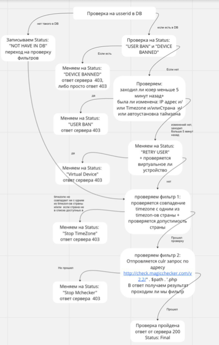
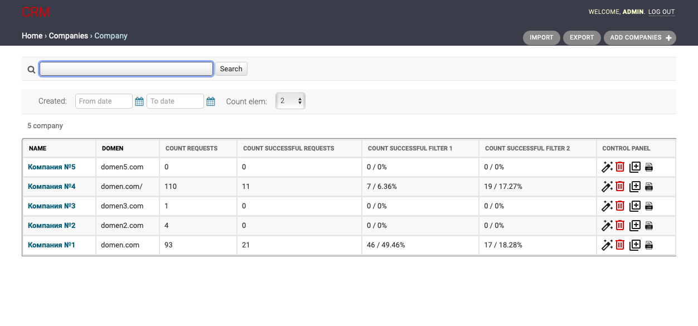
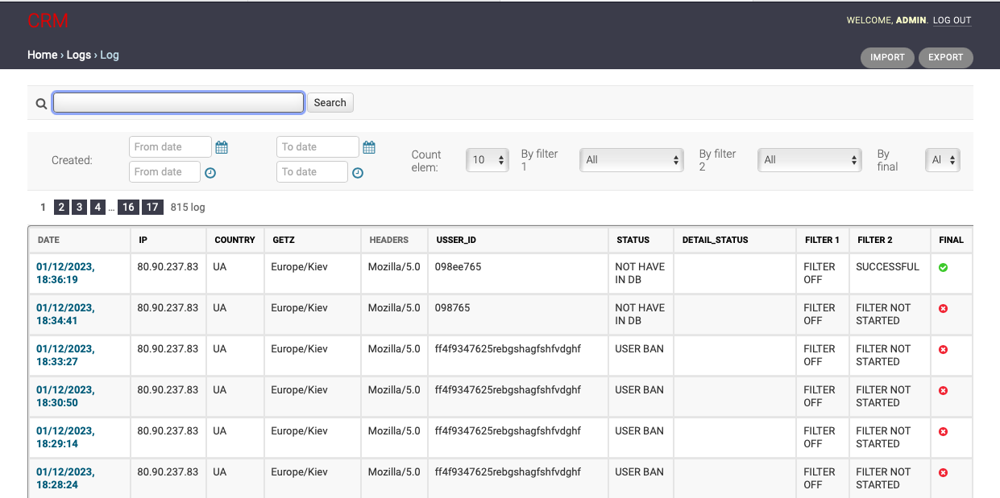

### CRM система 

#### Администрирование 
Админы заведены по почте и паролю.
Вход осуществляется в два этапа: 
 * ввод логина пароля 
 * подтверждение через гугл аутентификатор 

#### Логика работы

1. Django Rest Framework принимает запросы типа: 

DOMEN.COM/?packageid=packageName&usserid=XXXXXXXXXXXX&getz=timeZone&getr=utm_source=google-play&utm_medium=organic

Здесь:

DOMEN.COM - Домен добавленный в сервер
packageid= Название пакета 
usserid=XXXXXXXXXXXX - вместо иксов будет идентификатор пользователя
getz=timeZone - timeZone это таймзона юзера (примеры: Europe/Moscow, Asia/Yekaterinburg и тд, нужна таймзона конкретного девайса)
utm_medium=organic - органические установки 

2. Далее запросы проходят проверки: фильтр 1 и 2

* Фильтр 1 по ГЕО. 
Входные данные, в кампании мы указываем страны для которых мы открываем наш фильтр. Для этих стран у нас в базе есть часовые пояса этих стран например - Если у нас открыта Франция то у нее вот такой часовой пояс Europe/Paris. Тогда в примере DOMEN.COM/?packageid=com.test&usserid=777ABC555&getz=Europe/Paris&getr=utm_source=google-play&utm_medium=organic 			Данные какая страна какие гео берем тут - https://goodtoolscron.xyz/iso/. По IP адресу мы определяем ГЕО
* Фильтр 2 MagicCheker 
обращаемся через php к magicCheker и получаем ответ. Тут главное что бы передавались корректно User-Agent в заголовке браузера 		КОД Меджекчекера (ДОБАВИТЬ)  Отдает ответ False / True

 

#### Таблица с компаниями содержит: 
 

Данные заданные админом : Название кампании , домен

Статистика по кампаниям:  Количество обращений, Кол-во прошедших
Кол-во не прошедших фильтр 1  и %, Кол-во не прошедших фильтр 2 и %

Панель управления: функции Редактировать Кампании, Дублировать Кампании, Удалять Кампании 

Также здесь доступен переход на страницу логи двойным щелчком мыши по строке интересующей юзера компании

Выше табличной части располагаются: фильтры, поиск , экшен кнопки 

Фильтры:  период (), количество отображаемых строк()

Поисковая строка: поиск по названию кампании

Кнопки: Экспорт, Импорт, переключение между страницами отображаемой в табличной части информации, добавить кампанию

#### Страница с Логами содержит

Данные полученные из ссылки Дату обращения (дд/мм/гг time) , IP, Страну 
ТаймЗону, Хедерс, userid 

Данные полученные в результате прохождения воронки: Status, Фильтр 1
Фильтр 2, Final

Выше табличной части располагаются: фильтры, поиск , экшен кнопки 

Фильтры:  период (), количество отображаемых строк(), фильтр 1, фильтр 2

Поисковая строка: поиск по IP кампании

Кнопки: Экспорт, Импорт, переключение между страницами отображаемой в табличной части информации

Также здесь можно вернуться на главную страницу по клику на кнопку назад в верхней левой части страницы
